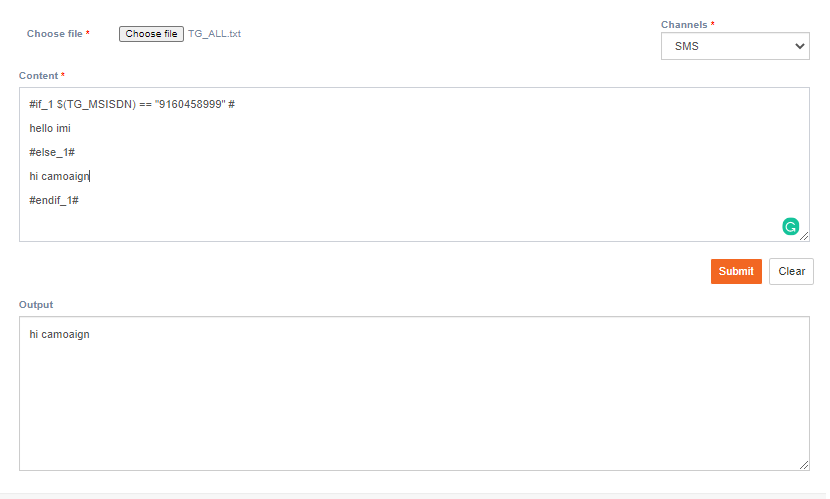

# Conditional evaluator

**Navigation**: Activities &gt; Conditional evaluator

This screen allows you to evaluate the email. It helps you identify the image tag for which source is missing. That means when an Image tag is added in the HTML code but forgot to mention the URL for the image tag. This screen will also evaluate the condition.

The syntax of the condition is as follows:

> `#if_X#  
> #elseif_X#  
> #else_X#  
> #endif_X#`

Follow these steps to evaluate the condition.

1. Click **Choose file** and upload a Target Group file on which you want to perform the condition.
2. Select the **Channel**.
3. Enter the condition in the Content textbox.
4. Click **Submit**.

Once the condition is evaluated the results will be displayed.

