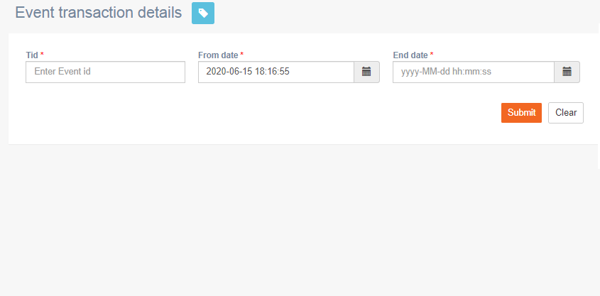

# Event transaction details

**Navigation**: Activities &gt; Event transaction details

This screen allows you to view event transaction details between the selected dates.

Follow these steps to view the event transaction details:

1. Enter the event transaction id.
2. Select **From date** and **End date**.
3. Click **Submit**.

### 

