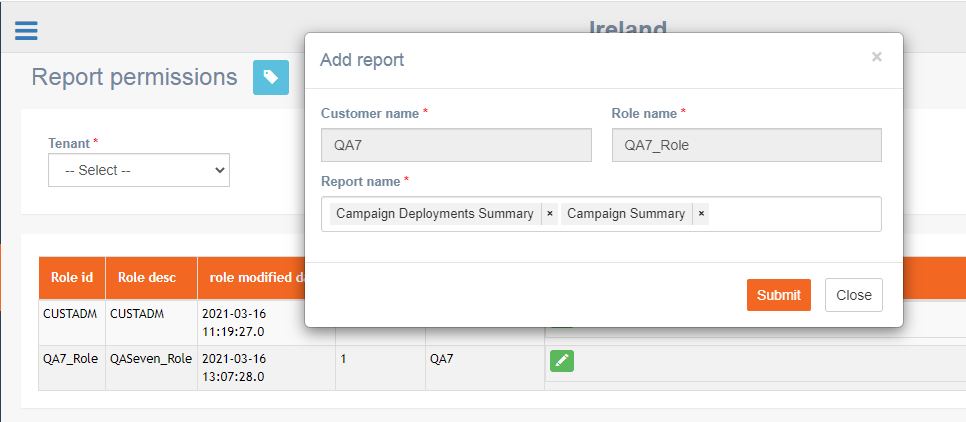
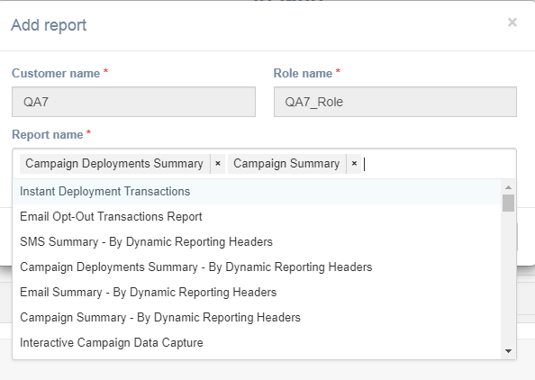

# Report Permission

**Navigation**: Activities &gt; Report Permission

In imicampaign, to assign a user with specific reports, the report has to be clicked and assigned to the specific user role. Image if there are 20 reports, then all 20 reports have to be opened and assigned to the specific user role one after the other. This is a time taking process.

This screen allows you to assign report permissions to a user role. You only have to select the specific user role and add all the required reports.

Follow these steps to add a report to a user role:

1. From the right menu, click Activities &gt; Report Permission.
2. Select a Tenant from the Tenant drop-down.
3. Click the **Edit** icon against the required user role.

In the above screen, only 2 reports were assigned to the user role.

 4. Click inside the report name and select the required reports.

 5. Click **Submit**.

In the above example, all the users of imicampaign who are assigned with the role QA7\_Role will get the additional reports

