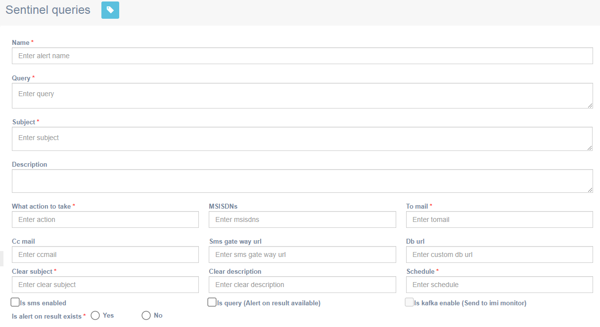
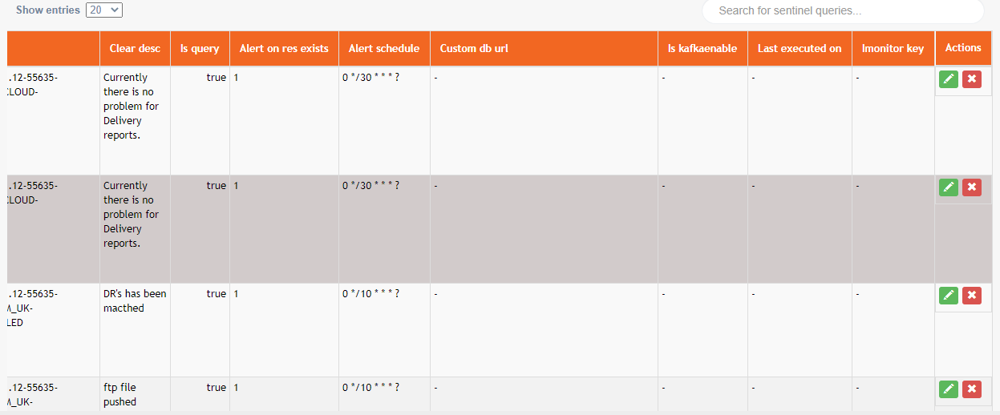

# Sentinal query

**Navigation:** Activities &gt; Sentinal query

This screen allows you to define sentinel queries. This screen will also show all the queries defined. You can enter the value of any header text in the search filter textbox to filter the queries.

Follow these steps to define sentinel queries:

1. From the Activities menu, select **Sentinal query**.
2. Enter details for the following fields.

* **Name**: Enter a name for the query. For example, DR\_RECEIVING\_IS\_LESS.
* **Query**: Enter the MySQL query. For example,

> SELECT a.campaign_id,a.msgs\_delivered 'msgs pushed',a. msgs\_actual\_delivered 'DRs Received' FROM campaigns\_report a,sms\_campaign b WHERE a.campaign\_id=b.campaign\_id AND a.campaign\_id LIKE 'SMS%' AND a.DAY=CURDATE\(\) and a.msgs_ to\_push&gt;50 AND b.dr\_required='1' and a.msgs\_actual\_delive red&lt;0 AND a.campaign\_id not in \('SMS\_1511947172711001821'\)

* **Subject**: Enter a subject for the query. For example,

> `CLMEVENT(CRITICAL) - touchstone-Campaign`_`Manager-CM_UK`_ `CLOUD-DR_RECEIVING_IS_LESS`

* **Description**: Enter a meaningful description. For example,

> `SMS Actual DR receiving less than 0%, Please check immediately.SMS Actual DR receiving less than 0%, Please check immediately.`

* **What action to take**: Enter an action that has to be taken to resolve this alert. For example,

> `Please inform your support team(L2) and ask them to verify the messages delivered.`

* **MSISDNs**: Leave this option empty.
* **To mail**: Enter the email IDs who should receive this alert.
* **Cc mail**: Enter the email ID that should be copied for this alert.
* **SMS Gateway URL**: Leave this option empty.
* **DB URL**: Leave this option empty.
* **Clear subject**: Enter the email subject. For example,

> `CLMEVENT(CLEAR) - 10.0.101.12-55635-Campaign_Manager-CM_UK_CLOUD-DR_RECEIVING_IS_LESS`

* **Clear** **Description**: Enter the description.
* **Schedule**: Enter the alert schedule in cron expression. For more information on Cron expression, click [here](https://help.imicampaign.io/en/articles/3789267-configuring-cron-expressions).
* **Is sms enabled:** Leave this option empty.
* **Is query \(Alert on result available\):** Select the checkbox to enable.
* **Is kafka enable \(Send to imi monitor\):** Leave this option empty.
* **Is alert on result exists:** Leave this option empty.

  3. Click **Submit**.

  4. \(Optional\) To view or edit a query, scroll to the right and click on the edit icon. The details will be shown above fields. You can make the required changes and click **Submit**.

  5. \(Optional\) To delete a query, click on the **Delete** icon of the respective query.

### 

