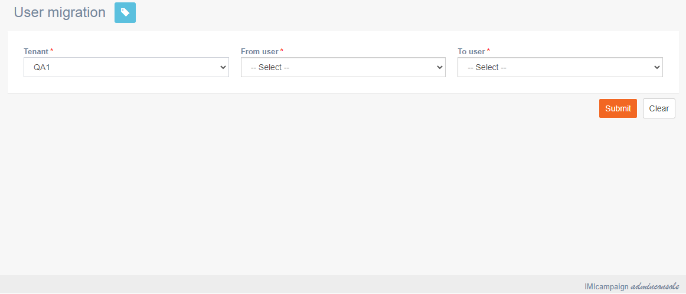

# User migration

**Navigation:** Activities &gt; User migration

This screen allows you to migrate assets from one user to another user in a tenant. This is useful when a user leaves the company.

Follow these steps to migrate user assets from one user to another user:

1. Click the **Tenant** drop-down and select a tenant.
2. Click **From user** drop-down and select the user from whom you want to migrate the assets.
3. Click to user drop-down and select the user to whom the assets will be migrated.
4. Click **Submit**.

### 

