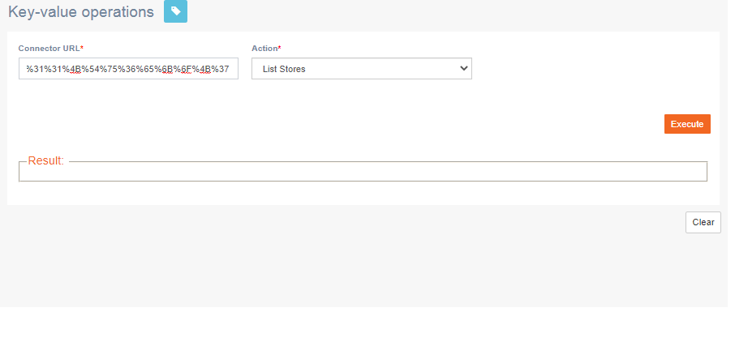

# USR\_DynamoDB

**Navigation:** Activities &gt; USR dynamo db

This screen allows you to view the DND stores of a campaign group. A DND store is created automatically for a campaign group.

Follow these steps to view DND stores:

1. Enter the URL where the DynamoDB is hosted.
2. Select the required action from the drop-down and click **Execute**.

Based on the action selected, additional options may appear. Enter details appropriately.

### 

