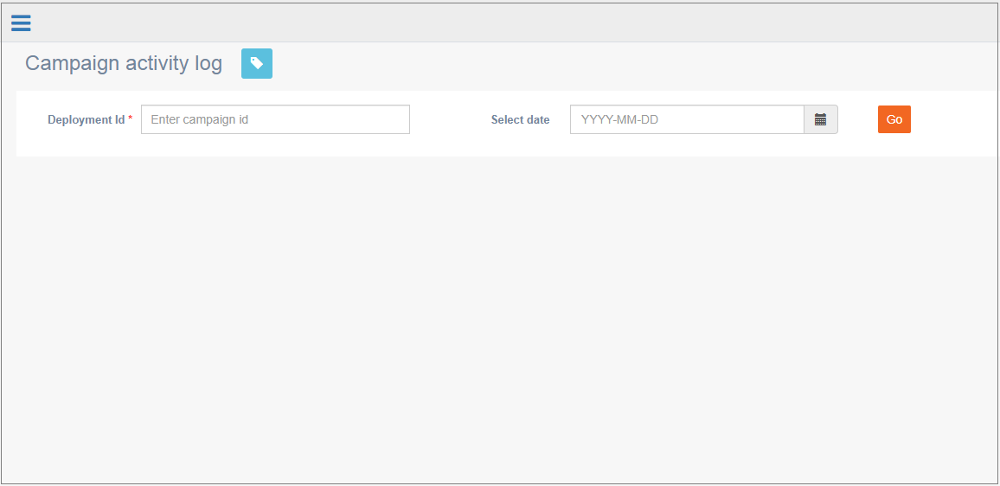

# Campaign activity log

**Navigation:** Monitoring &gt; Campaign activity log

This screen allows you to view the deployment activity logs for monitoring purposes. You can view the logs of specific deployment on a specific date.

This screen will display all the activities from deployment start to end. This is useful if a deployment is stopped without pushing all the records. You can view the activity log and act on why the deployment could not push all the records and push the remaining records.

You can enter the value of any header text in the search filter textbox to filter the results. For example, you can copy and paste the component value “TGPROCESSOR” in the search textbox. The results will display only the records that has value as “TGPROCESSOR”.

