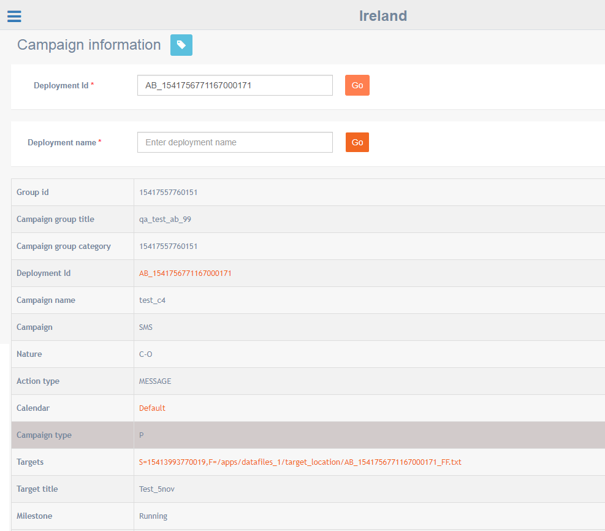

# Campaign information

**Navigation:** Monitoring &gt; Campaign information

This screen allows you to get the complete details of a deployment based on a deployment id or deployment name.

This screen will display the results in a single view. The details include Created by, Channel, Targets, Final target count, Deployment Start Date and Deployment End Date, deployment current status, etc.

