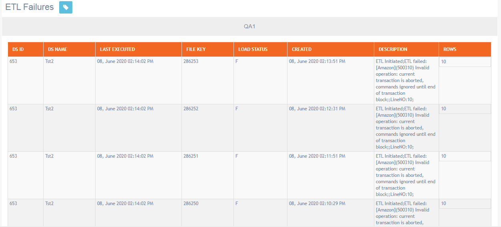

# ETL Failures

**Navigation:** Monitoring &gt; ETL Failures

This screen allows you to view ETL failure alerts. When the ETL is unable to download files from the server due to a file copied in the wrong path, network error, or server connection error then the system generates alerts. You can view when the ETL was last executed. You can also view the description for the failure reason. In such scenarios, ETL must be run manually again.

You can contact our L2 team in case you need any help.

### 

