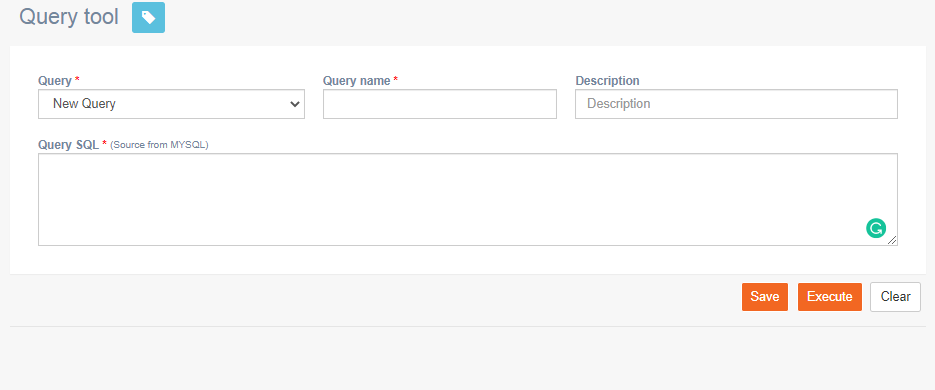

# Query tool

**Navigation:** Monitoring &gt; Query tool

This screen allows you to create and execute queries on campaign manager data using the MYSQL database. You can also save the queries and execute them at any time.

Follow these steps to create queries:

1. From the Monitoring menu, click **Query tool**.
2. Enter details for the following fields:
   * **Query**: Select **New Query** from the **Query** drop-down.
   * **Query Name**: Enter a name for the query.
   * **Description**: Enter a description.
   * **Query SQL**: Enter MYSQL query.
3. Click **Execute** the query.
4. \(Optionally\) Click **Save** to save the query to execute it in the future. Once you save the query, it will be displayed in the Query drop-down list.

### 

