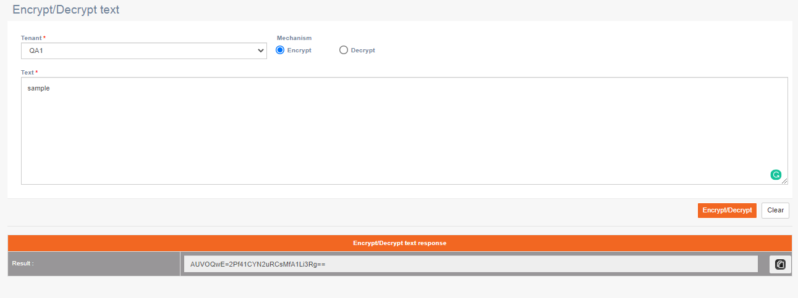
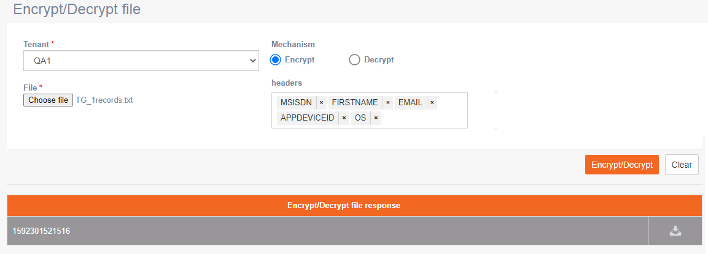

# Security

### Encrypt/Decrypt text

**Navigation**: Security &gt; Encrypt/Decrypt text

This screen allows you to encrypt or decrypt text.

Follow these steps to encrypt or decrypt a text:

1. Select a tenant from the drop-down.
2. Select an option to **Encrypt** or **Decrypt.**
3. If you select Encrypt, then enter the text. If you select Decrypt, then enter the encrypted text.
4. Click **Encrypt/Decrypt**.
5. The results will be displayed. You can copy the encrypted or decrypted text using the **Copy to clipboard**.

### Encrypt/Decrypt file

**Navigation**: Security &gt; Encrypt/Decrypt file

This screen allows you to encrypt or decrypt text.

Follow these steps to encrypt or decrypt a file:

1. Select a tenant from the drop-down.
2. Select an option to **Encrypt** or **Decrypt.**
3. If you select Encrypt, then upload the file that you want to encrypt. If you select Decrypt, then upload the encrypted file that you want to decrypt.
4. Click **Choose file** to upload a file**.**
5. Click the Headers field and select the required Headers you want to encrypt. If you want to encrypt all the headers, then select all the Headers.
6. Click **Encrypt/Decrypt**.
7. The results will be displayed. You can download the encrypted or decrypted file using the **Download** icon.

