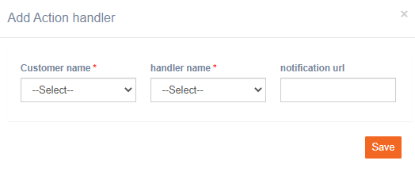

# Action Handlers

**Navigation:** Tenant management &gt; Basic configuration &gt; Action handlers

imicampaign allows you to configure action handlers exposed by other systems. The use of action handlers is to change the properties of components in response to an event.


This step has to be configured by imicampaign L2 team. Please get in touch with imicampaign L2 team when any such need arises.


When you add any action handler, some amount of development effort may be needed.

Follow these steps to add an action handler:

1. From the Tenant management &gt; Basic configuration menu, click **Action handlers.**

   2. Enter details for the following fields.

* **Customer name**: Select the customer name from the drop-down.
* **Handler name**: Select the handler name.
* **Notification url**: Enter notification URL.

   3. Click **Save**.

The details will be saved. Now the handler can be used in imicampaign.

