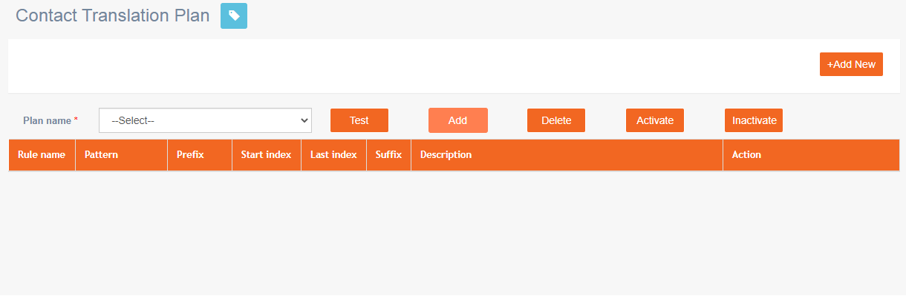
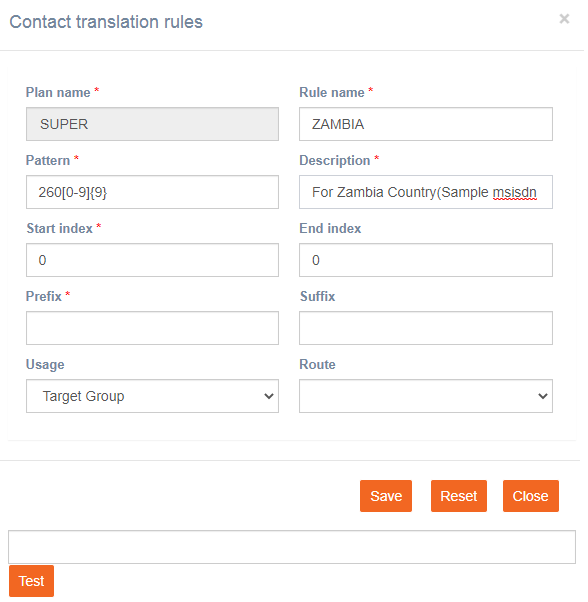

# Contact Translation Plan

**Navigation:** Tenant management &gt; Basic configuration &gt; Contact Translation Plan

This screen allows you to create a plan that defines the rules of the plan. The rules will determine and format MSISDN numbers before inserting them into the database. For example, using rules you can define which country mobile numbers should be processed. If the data contains MSISDN numbers of some other country, then such numbers will be ignored automatically from processing.

Follow these steps to add a plan:

1. Click **Add** on the Contact Translation Plan screen.
2. Enter a plan name and click **ADD**. The plan will be added to the list of plans.
3. Select the plan and click **Activate**. The plan gets activated.
4. Select the newly added plan from the drop-down list and click **+Add New.**

5. Enter details for the following fields:

* **Rule name**: Enter a name for the rule.
* **Pattern**: Enter the pattern that will be accepted for this rule. The pattern should be entered in a regular expression format. In the above example, 260 indicates the county code, \[0-9\] indicates any numbers from 0 to 9 and it should be of 9 digit number.
* **Description**: Enter a description for the rule. You can include the country name and sample phone number.
* **Start Index**: The default value is 0. You can proceed with it.
* **End Index**: The default value is 0. You can proceed with it.
* **Prefix**: We recommend you leave this blank. If you want to prefix the MSISDN number with country code, you can add country code as a prefix.
* **Suffix**: We recommend you leave this blank. If you want to suffix the MSISDN number with country code, you can add country code as a prefix.
* **Usage**: Select Target Group from the drop-down.
* **Route**: We recommend you leave this blank.

In the above screen, a plan is created as SUPER. Under this plan, a rule is defined as ZAMBIA. You can define any number of rules under a plan.

6. To test the pattern, enter a valid number in the test field and click **TEST**. In case if the number is not valid, it returns an error as “The given input does not match the given Pattern”.

7. Click **Save**.

This plan has to be selected under the Basic Parameters tab in the tenant creation screen.

