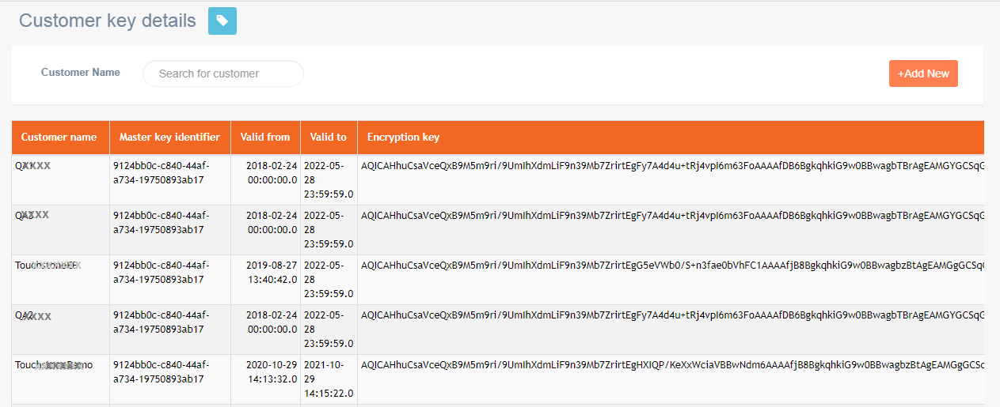
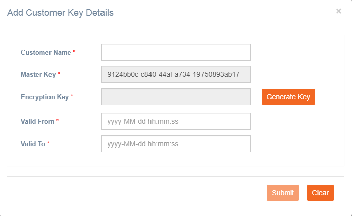

# Customer Key Details

**Navigation:** Tenant management &gt; Basic configuration &gt; Customer key details

The customer key is an encrypted key that is generated by appending the customer name with a master key identifier. The key details are stored in the customer key details section with a validity period. All the PII data is encrypted using this key.

Follow these steps to add customer key details:

1. On the **Customer key details** screen, click **+Add New**.
2. Enter details for the following fields:

* **Customer Name**: Enter the name of the customer.
* **Masterkey identifier**. This field is auto generated.
* **Encryption key**. Click **Generate Key**. An encryption key is generated for the customer using the customer name and masterkey identifier.
* Select **Valid From** and **Valid To** dates.

   3. Click **Submit**.

