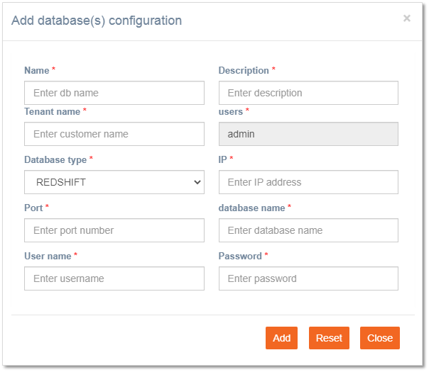

# Database\(s\) Configuration

**Navigation**: Tenant management &gt; Basic configuration &gt; Database\(s\) configuration

imicampaign allows the configuration of databases to access customers' data through the platform for creating campaign target groups. Campaign transactions \(RTE\) will be stored in this database. This database is used for follow-ups, Real-Time-Followups, Datastores, Querybuilder, etc.

Follow these steps to add a Database\(s\): 

1. Click **+ Add New** on the Database\(s\) configuration screen. 
2. Enter details for the following fields:

* **Name**: Enter the database name.
* **Description**: Enter a meaningful description.
* **Tenant name**: Enter the tenant name.
* **Database type**: Select the database from the drop-down.
* **IP**: Enter the IP address of the database.
* **Port**: Enter the port number to access the database.
* **Database name**: Enter the name of the database.
* **User name**: Enter a user name to access the database. 
* **Password**: Enter the password to access the database.

3. Click **Add**. The database gets added to the admin console. This has to be selected under the Basic Parameters tab in the tenant creation screen. 

4. \(Optional\) To edit a database, click the **Edit** icon and make appropriate changes and click Update.

5. \(Optional\) To deactivate a database, click the thumb icon. To activate it again click the thumb icon only. 

6. \(Optional\) To delete a database, click the **Delete** icon. The database gets deleted. 


While in an active state, the Database\(s\) cannot be edited or deleted. It must first be deactivated.


