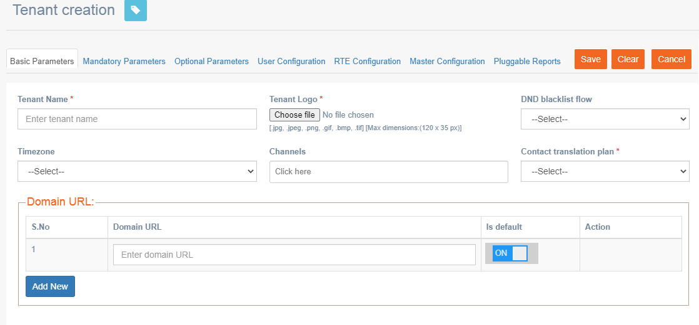
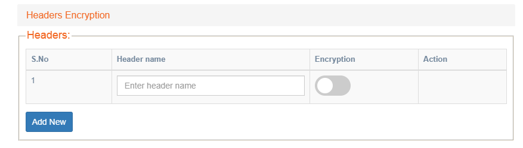
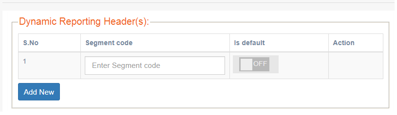
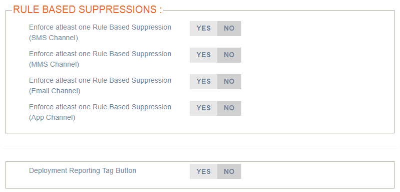
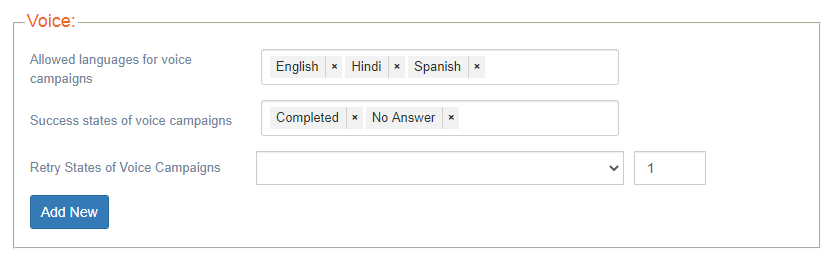
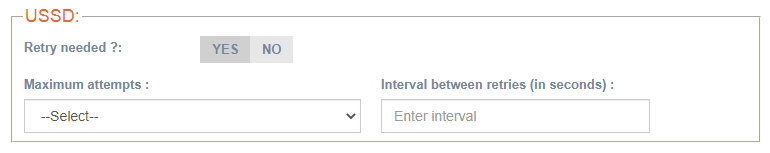
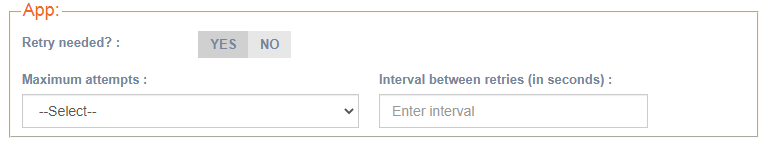
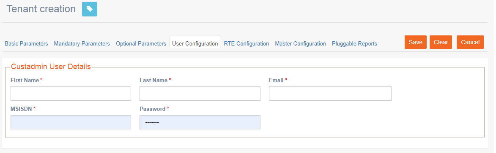
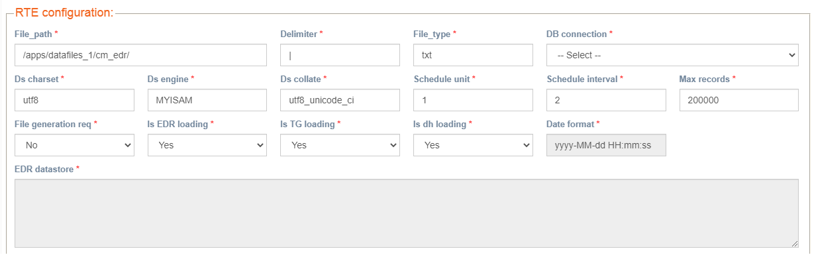
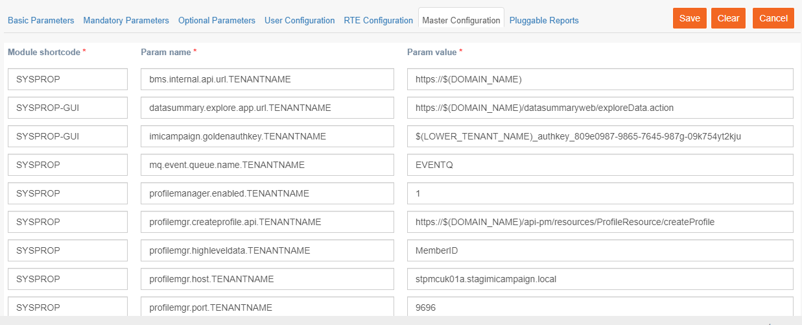

# Tenant Creation

**Navigation:** Tenant management &gt; Basic configuration &gt; Tenant creation

This screen allows you to create a tenant.

Follow these steps to create a tenant:

1. From the left menu, click Tenant Management &gt; Tenant Creation. The tenant list screen appears.
2. Click **+ ADD NEW**. The Tenant creation screen appears with different tabs. Configure the details in each tab.
3. After you configure each tab, click **Save**.

### **Basic Parameters:**

* **Tenant Name**: Enter an alphanumeric name for the tenant. Any special characters are not allowed. For example, _myimicampaign1._
* **Tenant Logo**: Click **Choose file** and select a logo for the tenant. The logo size should be less than 120x35 px.
* **DND blacklist flow:** Choose **Default**.
* **Timezone:** Select the timezone from the drop-down.
* **Channels:** Select the required channels.
* **Contact translation plan:** Select the contact translation plan.
* **Domain URL:** Enter a URL for the tenant. For example, _demo.imicampaign.io._


Only one domain should be selected as Default.


* **Is default:** Set to **ON** to make the tenant default.
* **Remove:** Click **REMOVE** to remove a URL.
* **Add New:** Click **Add New** to add more URLs.

### **Mandatory Parameters:**

For each parameter, we recommend the following settings for the best use and enhanced performance of imicampaign. You can enable or disable some parameters as required:

| Parameter | Recommendation | Description |
| :--- | :---: | :--- |
| HTTPs enable | YES | Select YES to enable HTTPS for the tenant. |
| SMS link tracking | YES | Select YES and then select the Short domain from the drop-down. |
| Link encryption | YES | Select YES to enable link encryption. |
| Profile manager | YES | Select YES to use Profile Manager. |
| Analytics Tags | NO | Select YES as the default option. If you want to use Google Analytics UTM tags, then select YES and enter the UTM tags. These tags will be used in Email channel deployment. |
| Credit deduction | NO | Select NO as the default option. |
| Policy management | YES | Select YES as the default option. |
| Mandatory attributes | YES | Select YES as the default option. |
| Pre-populated values | YES | Select YES as the default option. |
| A/B allowed | YES | Select YES as the default option. |
| Facebook custom audience management | NO | Select No as the default option. If you want to use the Facebook channel, select YES and enter the email id to receive the notifications. |
| MSISDN profile | YES | You can select NO to proceed. When the profile is loaded, select YES and update the profile id. |
| Enable AMP HTML | NO | Select NO as the default option. If you want to use the  Email channel, select YES to be able to use AMP HTML |
| Contact search allowed | YES | Select YES as the default option. |
| Enable SFE | NO | Select NO as the default option. |
| Landing pages | YES | Select YES as the default option. |
| API golden auth key | YES | Select YES as the default option. |
| Enable Azure SAML Authentication | NO | Select NO as the default option. Select YES to enable SAML authentication. |
| Password policy for schedule reports FTP-Upload | YES | Select YES as the default option. |
| Password policy for schedule reports email-Upload | YES | Select YES as the default option. |
| Enable time zone conversion | NO | Select NO as the default option. |
| Enable data encryption | NO | Select NO as the default option. |
| Enable Auto TPS | YES | Select YES as the default option. |
| Allow Custom TG Preparation | NO | Select NO as the default option. |
| Enable TRAI | NO | Select NO as the default option. |
| Enable Return Path | NO | Select NO as the default option. |

**Headers Encryption**

If Encryption is enabled at the tenant level, by default MSISDN, EMAIL, APPDEVICEID, and Master Profile Key will be Encrypted.

To encrypt other headers, click **Headers Encryption** and enter the required headers.


You cannot roll back encryption-related settings once configured.


### **Optional Parameters**

**Dynamic Reporting Headers**: You can leave this empty for now. You can configure this section if you want to generate dynamic header reports. After loading the data you can decide on which header you want to generate reports. A dynamic header report will be configured based on the selected header and is available in imicampaign &gt; Dashboard &gt; Reports section.

**Rule Based Suppressions**: Select NO for these 4 channels. If you want to enforce rule based suppressions for a particular channel then select YES for the required channel.

This feature makes it easier for you to enforce adherence to your customers’ opt-out preferences. It is useful for clients who have a large number of imicampaign users setting up a large number of Campaign Deployments. A challenge for these clients is how to reduce the possibility that their team of deployment-creators might forget to include some important contact-suppression criteria as part of Target Group definitions.

The rule based suppressions are used to suppress contacts from target groups who meet defined conditions in the rules that are part of rulesets. The rulesets can be defined in IMIcampaign. A ruleset can contain one or more rules. For example, if your target group has an attribute as "Location". You want a deployment not to be sent to specific contacts whose location is "Chester", then create a rule such as "Location equals Chester". When a deployment is created with the target group and the rule is applied, the deployment will not be sent to those contacts whose location is "Chester". 

When this option is enabled, you cannot activate a deployment without a ruleset.

**Deployment Reporting Tag Button**: Select **NO** as the default option. This option allows you to generate a custom code for deployment and is tagged to the deployment. To use this option, select **YES** and then enter a name for the button which will be displayed in IMIcampaign under What tab.

**Voice Channel Configuration**

If you select the Voice channel in the **Basic Parameters** tab, then the voice channel settings will be displayed. If not, the configuration buttons will not be displayed.

* **Allowed languages for voice campaigns**: Select the languages from the list.
* **Success states of voice campaigns**: Select the status from the list.
* **Retry States of Voice Campaigns**: Select the status when the retry should occur and also enter the interval in seconds for retry. Click **Add New** to add more retry status.

**USSD Channel Configuration**

If you select the USSD channel as one of the required channels in the **Basic Parameters** tab, then the USSD channel settings will be displayed. If not, the configuration buttons will not be displayed.

Select **YES** to enable retry for the USSD channel and configure the number of attempts and the interval \(in seconds\) between each retry the system should attempt. You can select a maximum of up to 3 attempts.

**App Push Channel Configuration**

If you select the APP channel as one of the required channels in the **Basic Parameters** tab, then the APP Push channel settings will be displayed. If not, the configuration buttons will not be displayed.

Select **YES** to enable retry for the App Push channel and configure the number of attempts and the interval \(in seconds\) between each retry the system should attempt. You can select a maximum of up to 3 attempts.

### **User Configuration**

The User configuration tab allows you to create a custom admin user. This user will have all permissions to create and edit other users.

Follow these steps to add a cust admin user:

1. Enter the following details to create a cust admin user.

* **First Name**: Enter the first name of the cust admin user.
* **Last Name**: Enter the last name of the cust admin user.
* **Email**: Enter the email id of the cust admin user.
* **MSISDN**: Enter the mobile number
* **Password:** Enter a password.

   2. Click **Save**.

Once the details are saved, share the cust admin details with the user and ask him/her to change the password and proceed to create other users and assets as required.

### **RTE Configuration**

The RTE Configuration tab allows you to configure settings to process RTE files. On this screen, you can continue with the default values displayed. You only have to select the below option:

* **DB connection**: Select the DB connection. The DB should have been created earlier from the Tenant Management &gt; Database\(s\) configuration screen.


Do not modify other options. You only have to select the DB connection.


### **Master Configuration**

The Master Configuration tab displays all the configurable parameters of the system. This is a tenant-level setting and it allows the tenant to access all/shared components of imicampaign which may include parameters of the database or submodules within imicampaign.

By default, the parameters are generated automatically.

#### 

