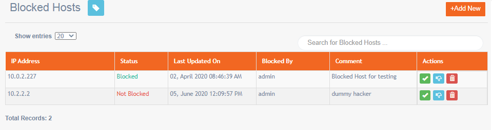
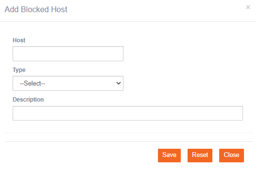

# Blocked Hosts

**Navigation:** Tenant Management &gt; Blocked Hosts

IMIcampaign has security features in place in order to protect the platform and prevent unauthorized access. Five consecutive invalid login attempts block the IP address the user is logging in from. You can also block or unblock an IP address from accessing imicampaign by adding the IP address in the admin console.

### Block a New IP Address

Follow these steps to block an IP address:

1. From the Blocked Hosts screen, click **+Add New**.

  2. Enter details for the following fields:

* **Host**: Enter the IP address.
* **Type**: Select whether the IP is an External or Local.
* **Description**: Enter a meaningful description

  3. Click **Save**.

The IP address will be blocked from accessing the IMIcampaign.

### Unblock or Delete an IP Address in the List

Follow these steps to unblock an IP address:

1. From the Blocked Hosts screen, locate the IP address from the list.
2. Click the Thumb icon against the respective host. The host gets unblocked.
3. To delete a host, click the **Delete** icon against the respective host.

