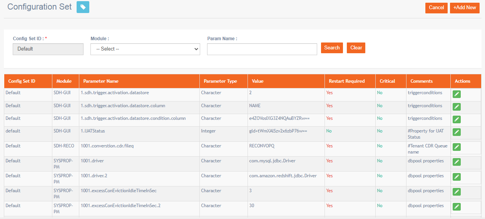
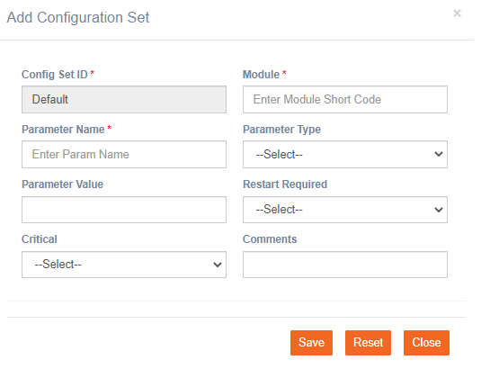

# Configuration Set

**Navigation:** Tenant Management &gt; Configuration Set

This step has to be configured by imicampaign L2 team.

This screen allows you to add imicampaign configuration parameters to the admin console. Configuring them manually is error-prone. In case, if there are any changes to the parameters, you can add or edit them with the help of imicampaign L2 team.

Follow these steps to add a new parameter:

1. From the Configuration Set screen, click **+ Add New**.
2. Enter details for the following fields:

* **Module:** Enter the name of the sub-module component of imicampaign.
* **Parameter Name:** Enter the parameter name.
* **Parameter Type:** Select the parameter type.
* **Parameter Value:** Enter the parameter value.
* **Restart Required:** Select **Yes**, if a restart is required.
* **Critical**: Select **Yes**, if it is a critical parameter.
* **Comments**: Enter comments if any.

3. Click **Save**.

4. \(Optional\) To edit a parameter, enter the parameter name in the **Param Name** field and click **Search**. Once the results are displayed, click on the edit icon and make appropriate changes and click **Update**.

The parameter will be added to the system.

