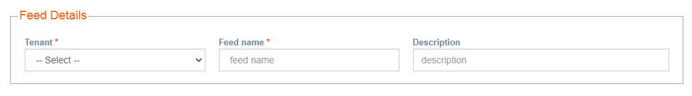
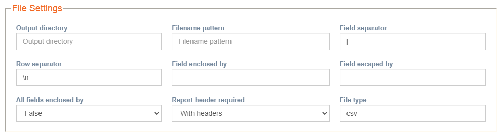
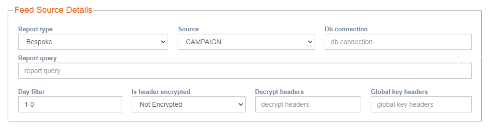
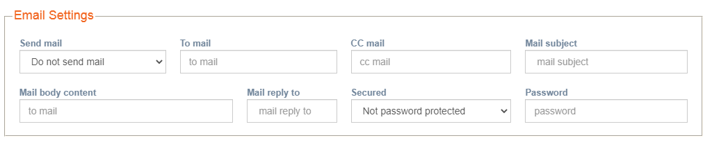
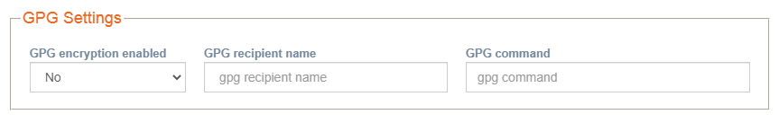
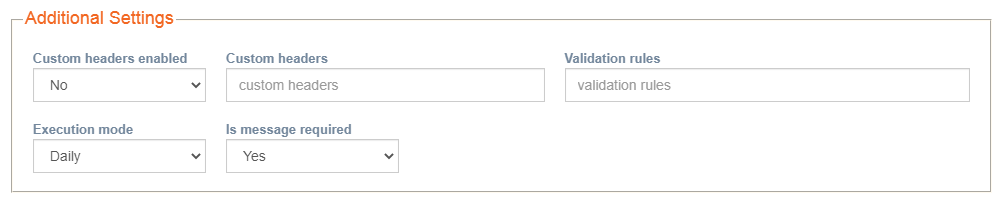

# Customer feeds

**Navigation:** Tenant Management &gt; Customer feeds

This screen allows you to create custom reports. imicampaign provides a set of standard reports. In case if you want a custom report to be generated apart from the standard reports, then using this screen you can create the custom reports. These reports can be delivered to the configured email ids.

imicampaigns’ RTE can have up to 85 columns. If the data has more than 85 columns, then this screen is used to create reports with more than 85 columns.

Follow these steps to create customer feeds:

1. From the Tenant Management menu, click Customer Feeds.
2. Enter details for the following fields:

**Feed Details**

* **Tenant:** Select the Tenant name from the drop-sown.
* **Feed name:** Enter the feed name.
* **Description:** Enter a meaning description for the feed.

**File Settings**

* **Output Directory: Enter** the output directory. Enter the path as /apps/datafiles\_1/feeds\_all/&lt;&lt;tenantname&gt;&gt;/
* **Filename pattern:** Enter the file name pattern. For example,

| **File Name** | **Source File Pattern** |
| :--- | :--- |
| IMI\_EDR\_2020\_01\_10\_01.txt | IMI\_EDR\_&YYYY&\_&MM&\_&DD&\_&HH&\_&mm&.txt |
| IMI\_EDR\_2020\_12-23\_file1.txt | IMI\_EDR\_&YYYY&\_&MM&-&DD&\_&WORD&.txt |
| IMI\_EDR\_25\_10-2019\_file2.txt | IMI\_EDR\_&DD&\_&MM&-&YYYY&\_&WORD&.txt |

* **Field separator:** Enter the field separator. The default option is \| \(pipe\).
* **Row separator:** Enter the row separator. The default option is \n.
* **Field enclosed by:** Enter the field enclosed by character. The option is “ ” \(double quote\).
* **Field escaped by:** Enter the field escaped by character. The option is \ \(back slash\).
* **All fields enclosed by:** Select **False** as default option.
* **Report header required:** Select if the report should be generated with the headers. The options are **With Headers** and **Without Headers.**
* **File type:** Enter the File type. Allowed values are CSV or. XLS.

**Feed Source Details**

* **Report Type:** Select the report type. The options are **Shell Script** or **Bespoke**. Select the default option as **Shell Script**.
* **Source:** Select the source of the feed from the drop-down. The options are RTE, EDR, CAMPAIGN, and OTHER.
* **Db connection:** This option is required when you select the Source as OTHER. The OTHER option refers to the database that is configured using the Database\(s\) configuration screen. Get the DB connection ID from imicampaign L2 team.
* **Report query:** Write your SQL as required.
* **Day filter:** Enter the days separated by ‘-’ to pick up a file for data loading. For example, if today's date is 15th June, if you enter 1-5, it indicates that the system has to pick up files of 1 day from the previous 5th day from the current date \(10th June file\). If you enter 2 - 3, the system will pick up files of 2 days from the previous 3rd day from the current date \(12th and 11th June\). 
* **Is header encrypted:** Select **Encrypted**, to encrypt the header, else select **Not Encrypted**.
* **Decrypt headers:** If you select **Is headers encrypted as Encrypted** then enter the PII headers to be decrypted.
* **Global key headers:** If you select **Is headers encrypted as Encrypted** then enter the headers to be decrypted by Global Key.

**Email Settings**

* **Send mail:** Select if you want to receive the feed to your email as an attachment. Else the feed will be saved in the output folder configured.
* **To mail:** Enter the email id to receive the feed.
* **CC mail:** Enter the email ids of other recipients under CC mail.
* **Mail subject:** Enter the subject line of the email.
* **Mail body content:** Enter the email body.
* **Mail reply to:** Enter reply to the Email id.
* **Secured:** Select if the zip file has to password protected. The options are **Password protected zip file** and **Not password protected**.
* **Password:** If you choose to password protected zip file, then enter the password.

**GPG Settings**

* **GPG encryption enabled:** Select **Yes** to enable GPG encryption for the feed.
* **GPG recipient name:** This will be provided by the client.
* **GPG command:** Enter the GPG command. For example,

_gpg2 --batch --always-trust --yes --output $\(DestinationFilePath\) --recipient $\(RecipientName\) --encrypt $\(SourceFilePath\)_

**Additional Settings**

* **Custom headers enabled:** Select **Yes** to enable custom headers.
* **Custom headers:** Enter custom headers. For example,

_{tgdetails:MSISDN},{tgdetails:EMAIL},{tgdetails:CUSTOMFIELD2},{tgdetails:TARGETKEYCODE},DELIVERYSTATUS_

* **Validation rules:** Enter validation rules.
* **Execution mode:** Select the execution mode. The options are **Daily** and **Hourly**.
* **Is message required:** Select **Yes** if the message is required.

1. Click **Save**.

