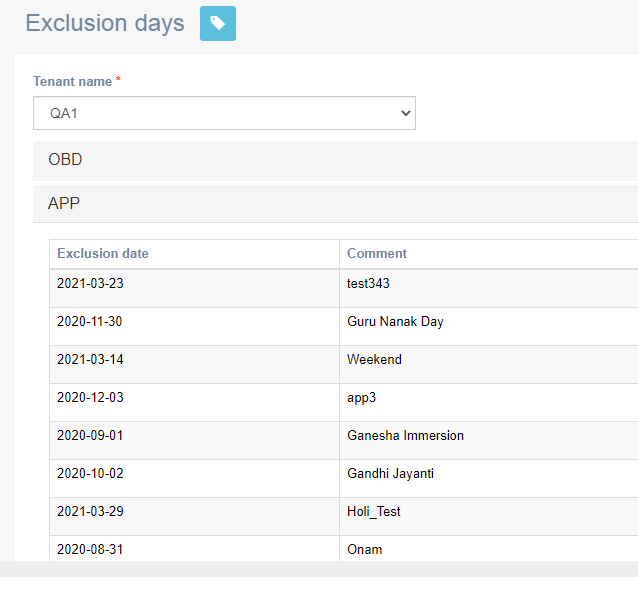

# Exclusion days

**Navigation**: Tenant Management &gt; Exclusion days

Exclusion days allow Administrators to pause campaign deployments on a particular day, to avoid sending customers untimely campaign messages on specific days.

For example, as a global default, campaigns might be paused between midnight and 7 am, on public holidays or during religious festivals.

This screen allows you to view the Exclusions days for a specific channel.


The exclusions days are based on the configured time-zone and are configured on a channel basis.


During exclusion periods, campaigns that are running have their status changed to pending and the execution is stopped. Once the exclusion period has expired, the campaign automatically acquires running status, and the execution is resumed.

Follow these steps to view exclusion day:

1. Select a tenant from the drop-down.
2. Click a channel to view the exclusion days configured.

