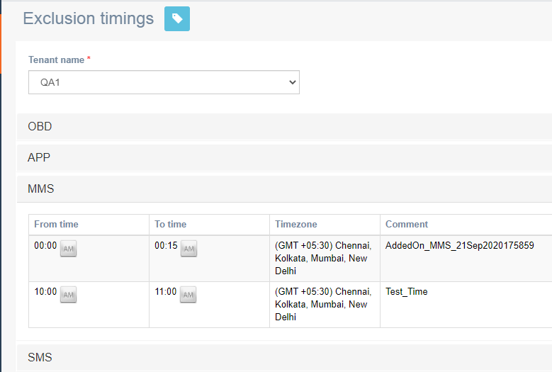

# Exclusion timings

**Navigation**: Tenant Management &gt; Exclusion timings

This screen allows you to view the exclusion timings for a tenant for a selected channel. This is a global setting applied to all campaigns under a tenant. During exclusion periods, campaigns that are running have their status changed to pending and the execution is stopped. Once the exclusion period has expired, the campaign automatically acquires running status, and the execution is resumed.

Follow these steps to view exclusion timings:

1. Select a tenant from the drop-down.
2. Click a channel to view the exclusion timings configured

