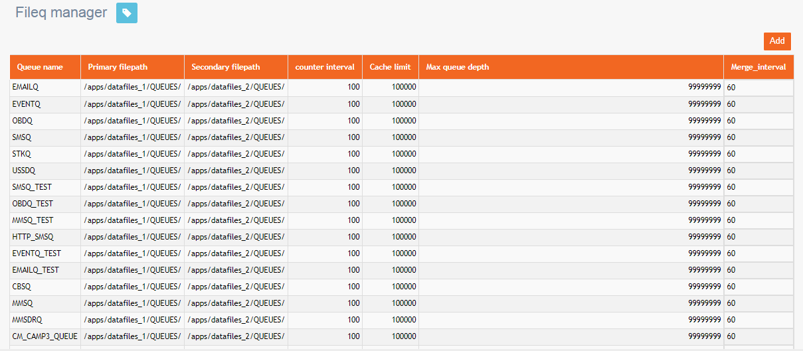
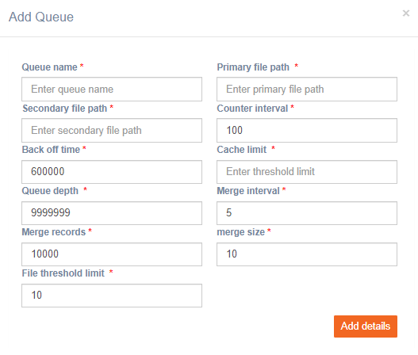

# FileQUI

**Navigation:** Tenant Management &gt; FileQUI

This screen allows you to add a file queue. This file queue is used to upload files and manage when they should merge with another file.

Follow these steps to add a file queue:

1. From the Tenant Management menu, click FileQUI.
2. Click **Add**.

  3. Enter details for the following fields:

* **Queue name:** Enter a name for the queue.
* **Primary file path:** Enter the primary file path.
* **Secondary file path:** Enter the secondary file path.
* **Counter interval:** Proceed with the default recommended setting.
* **Back off time:** Proceed with the default recommended setting.
* **Cache limit:** Enter the threshold limit.
* **Queue depth:** Proceed with the default recommended setting.
* **Merge interval:** Proceed with the default recommended setting.
* **Merge records:** Proceed with the default recommended setting.
* **Merge size:** Proceed with the default recommended setting.
* **File threshold limit:** Proceed with the default recommended setting.

  4. Click **Add details**.

