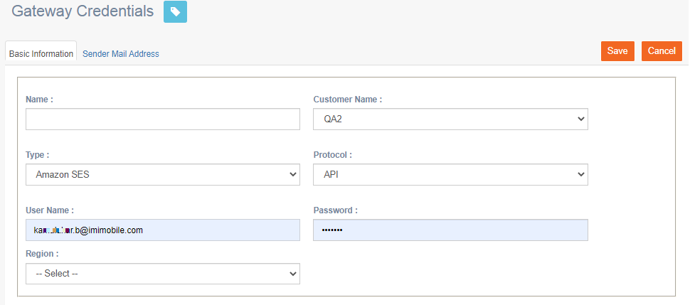

# Gateway Credentials

**Navigation:** Tenant Management &gt; Gateway Credentials

This screen allows you to create gateway credentials.

Follow the below steps to create gateway credentials:

1. From the Tenant Management menu, click Gateway Credentials.
2. Click **+Add New**.

  3. Enter details for the following fields under the Basic Information tab:

* **Name:** Enter a name for the gateway.
* **Customer Name:** Select the customer name from the drop-down.
* **Type:** Select the service provider type. For example, Amazon SES.
* **Protocol:** Select the protocol such as API or SMTP.
* **Region:** \(Optional\) Select the region.

  4. Under Sender Mail Address tab, enter the sender email id.

  5. Click **Save.**

