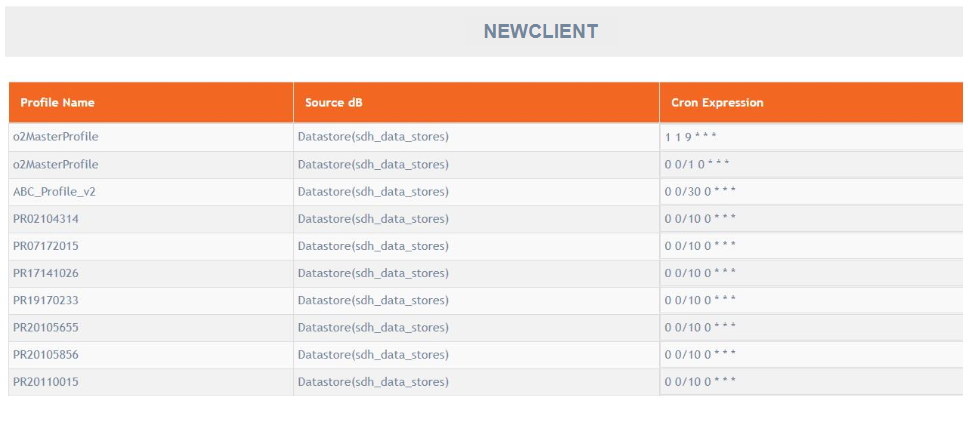

# Profile Schedules

**Navigation:** Tenant Management &gt; Schedules

This screen allows you to view all the scheduled profiles scheduled by different users of a tenant. This is the only place from which you can see a consolidated list of all scheduled profiles.

Follow the below steps to view the profiles of a tenant:

1. From the menu, click Tenant Management and then Profile Schedules.
2. Select a tenant from the list. All the profile schedules will be displayed along with their schedule in cron expression.

It is a view-only option, hence you cannot add or edit or delete anything on this screen.

