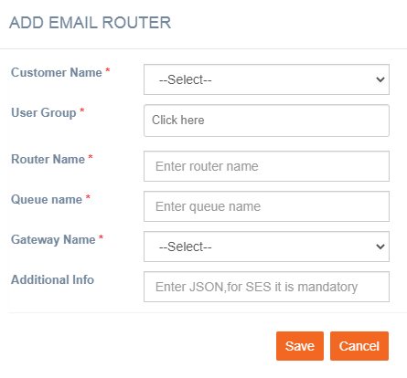

# Email Routers

**Navigation:** Tenant Management &gt; Routing &gt; Email Routing

Follow the below steps to add an Email router:

1. From the Tenant Management menu select Routing &gt; Email Routing.
2. Click **+Add New**.

   3. Enter details for the following fields:

* **Customer Name**: Select the customer name from the drop-down.
* **User Group**: Enter a name for the user group
* **Router Name**: Enter a name for the router.
* **Queue name**: Enter a queue name.
* **Gateway Name**: Select a gateway from the drop-down.
* **Additional Info**: If you select SES as the gateway, enter JSON in this field.

   4. Click **Save.**

Now the router can be used for Email channel deployments in IMIcampaign.

