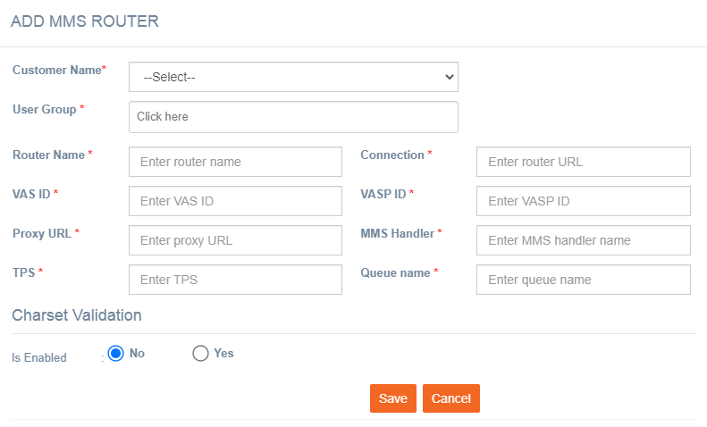

# MMS Routers

**Navigation:** Tenant Management &gt; Routing &gt; MMS Routing

Follow the below steps to add an MMS router:

1. From the Tenant Management menu select Routing &gt; MMS Routing.
2. Click **+Add New**.

  3. Enter details for the following fields:

* **Customer Name**: Select the customer name from the drop-down.
* **User Group**: Enter a name for the user group
* **Router Name**: Enter a name for the router.
* **Connection**: Enter the connection details. For example, [https://183.31.126.196:1090/bulk](https://183.31.126.196:1090/bulk).
* **VAS ID**: Enter the vas application id.
* **VASP ID**: Enter the VASP ID.
* **Proxy URL**: Enter a proxy URL.
* **MMS Handler**: Enter the MMS handler. For example, com.imi.bms.mmshandler.BBMMSSubmitAdaptor
* **TPS**: Enter the allowed TPS for the router.
* **Queue name**: Enter the Queue name.
* **Charset Validation**: Select **No**.

  4. Click **Save**.

Now the router can be used for MMS channel deployments in imicampaign.

