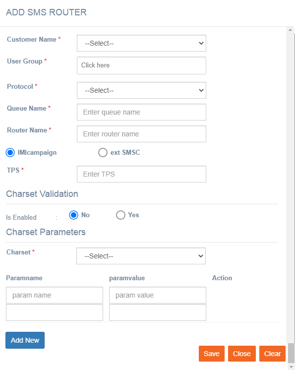

# SMS Routing

**Navigation:** Tenant Management &gt; Routing &gt; SMS Routing

SMS Routes are configured. The user is able to see routes assigned to the account \(permissions enabled\) and can view the valid characters that have been configured for the applicable router if this feature is switched on.

Follow the below steps to add an SMS router:

1. From the Tenant Management menu, select Routing &gt; SMS Routing.
2. Click **+Add New**.

   3. Enter the details for the following fields:

* **Customer Name**: Select the customer name from the drop-down.
* **User Group**: Enter a name for the user group
* **Protocol**: Select the protocol for the router.
* **Name**: Enter a name for the router.
* **Queue Name:** Enter a queue name for the router.
* **Router Name:** Enter the router name.
* **Router URL:** This option is applicable if the protocol is selected as HTTP, HTTPS, MAP. Enter the URL of the router.
* **IMIcampaign:** This option is selected by default as the SMS router.
* **Ext SMSC:** Select this option if you are using external SMSC.
* **TPS**: Enter the TPS that is allowed for the router.
* **FTP Site**: This option is applicable if the protocol is selected as FTP. Select the FTP name from the drop-down.
* **Charset Validation Is enabled**: Select **No**.
* **Charset**: Select GSM from the drop-down.
* **Paramname**: Enter Parameter name.
* **Paramvalue**: Enter Parameter value.
* **Add New**: Click Add New to add more parameters.

   4. Click **Save**.

Now the router can be used for SMS channel deployments in imicampaign.

