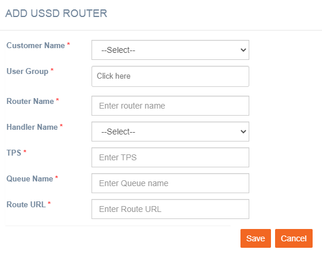

# USSD Routing

**Navigation:** Tenant Management &gt; Routing &gt; USSD Routing

Follow the below steps to add a USSD router:

1. From the Tenant Management menu select Routing &gt; USSD Routing.
2. Click **+Add New**.

  3. Enter details for the following fields:

* **Customer Name**: Select the customer name from the drop-down.
* **User Group**: Enter a name for the user group
* **Router Name**: Enter a name for the router.
* **Handler Names**: Select the handler name from the drop-down.
* **Tps**: Enter the TPS for the USSD channel.
* **Queue Name**: Enter the Queue name.
* **Route URL**: Enter the URL of the router.

  4. Click **Save.**

Now the router can be used for USSD channel deployments in imicampaign.

