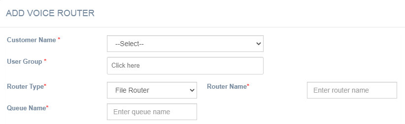
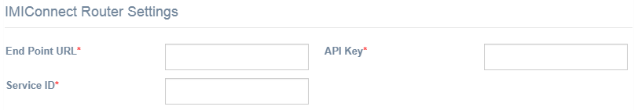
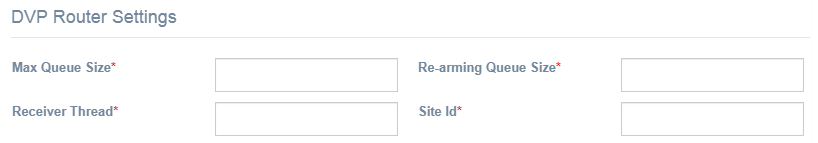
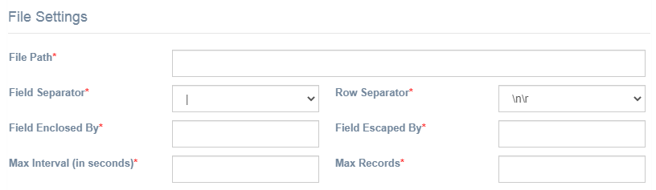
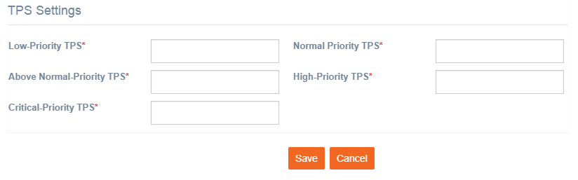

# Voice Routing

**Navigation:** Tenant Management &gt; Routing &gt; Voice Routing

Follow the below steps to add a Voice router:

1. From the Tenant Management menu select Routing &gt; Voice Router.
2. Click **+Add New**.

  3. Enter details for the following fields:

* **Customer Name**: Select the customer name from the drop-down.
* **User Group**: Enter a name for the user group
* **Router Type**: Select the router type from the drop-down. Based on the selected router, additional fields will be displayed.
* **Router Name**: Enter a name for the router.
* **Queue Name**: Enter the Queue name.

**IMIconnect Router Settings:** These fields are applicable if the router type is selected as IMIconnect Router

* **End Point URL:** Enter the endpoint URL.
* **API Key:** Enter the API Key.
* **Service ID:** Enter the service id.

**DVP Router Settings:** These fields are applicable if the router type is selected as DVP Router

* **Max Queue Size:** Enter the max queue size.
* **Re-arming Queue Size:** Enter the rearming queue size.
* **Receiver Thread:** Enter the receiver thread.
* **Site Id:** Enter the site id.

**File Router Settings:** These fields are applicable if the router type is selected as File Router.

* **File Path:** Enter the File path.
* **Field Separator:** Select the field separator from the drop-down.
* **Row Separator:** Select the row separator from the drop-down.
* **Field Enclosed By:** Enter the field enclosed by value.
* **Field Escaped By:** Enter the field escaped by value.
* **Max Interval \(in seconds\):** Enter the interval in seconds.
* **Max Records:** Enter the maximum records limit for the file.

**TPS Settings**: Configure the TPS settings for the router.

* **Low Priority TPS**: Enter the TPS for low priority.
* **Normal Priority TPS**: Enter the TPS for normal priority.
* **Above Normal-Priority TPS**: TEnter the TPS for above normal priority
* **High Priority TPS:** Enter the TPS for high priority.
* **Critical Priority TPS:** Enter the TPS for critical priority

  4. Click **Save.**

Now the router can be used for Voice channel deployments in IMIcampaign.

