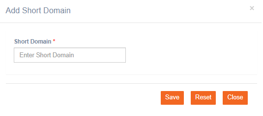

# Short Domains

**Navigation**: Tenant Management &gt; Short Domain

The short domain is used to track links of an SMS or MMS deployment. The short domain is a tenant level setting. This is a mandatory step before creating a tenant. You will have to select the short domain while creating the tenant. If the short domain is not created, IMIcampaign will not be able to track the links.

Follow the below steps to create a short domain:

1. From the Tenant Management menu select Short Domains.
2. Click **+Add New**.

  3. Enter the domain name. 

  4. Click **Save**.

The short domain can be now configured in tenant creation.


Share this short domain with L2 to configure in Application Load Balancer. Without this mapping, short links will not be routed.


\*\*\*\*

