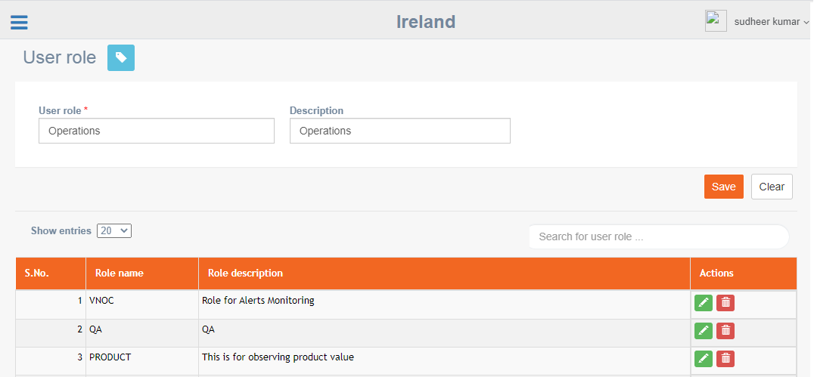
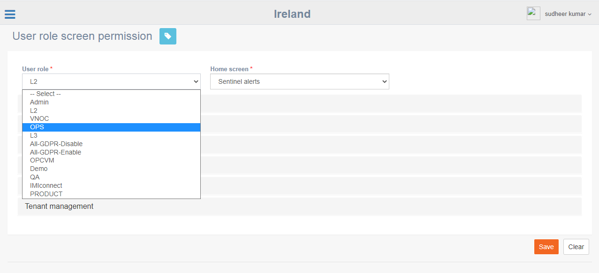
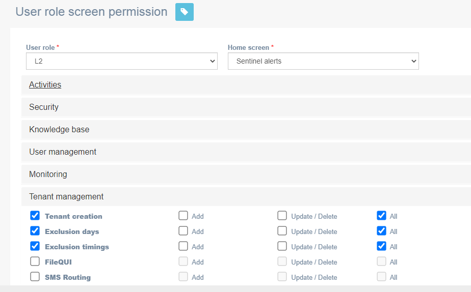
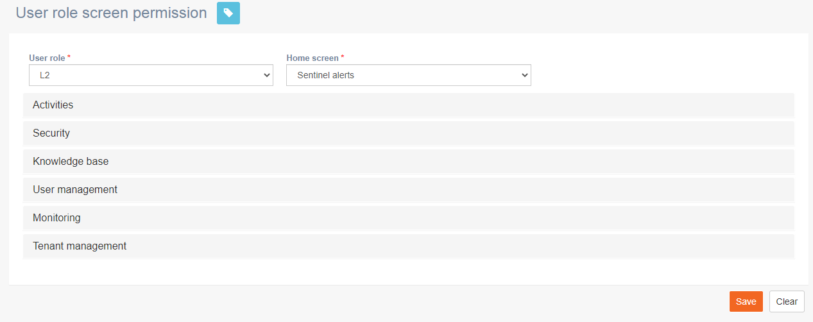
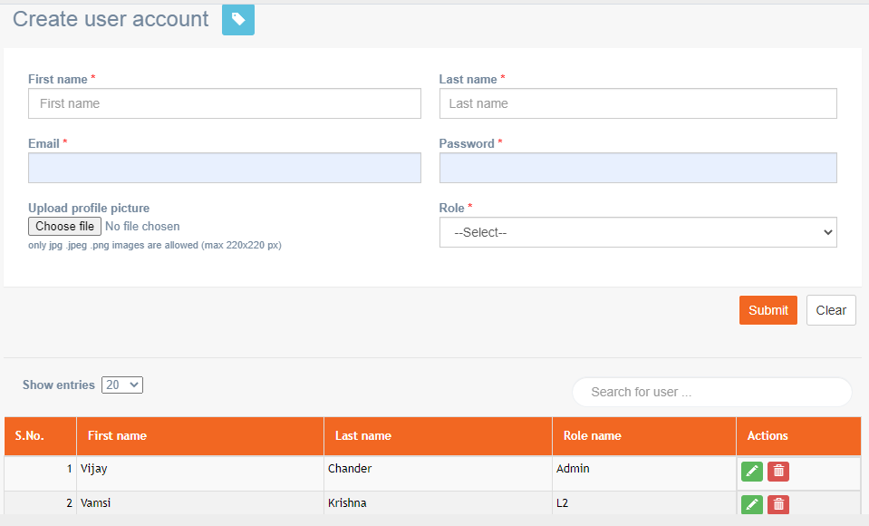

# User Management

User management allows you to create and manage users in imicampaign admin console.

### User Role

**Navigation**: User Management &gt; User role

This screen allows you to create a user role in imicampaign admin console.

 Follow these steps to create a user role,

1. On the User Role screen, enter a User Role name and description.
2. Click **Save**.

The role will be saved. The next step is to assign permission to User Role Screen.

### 

### User role screen permission

**Navigation**: User Management &gt; User role screen permission

This screen allows you to assign a user role with screen permissions.

 Follow these steps to assign user role screen permission:

1. From the menu click User Management and then click **User role screen permission**.

1. Select a **User role** from the drop-down.
2. Select a **Home screen** from the drop-down. The selected home screen will be displayed whenever a user logs in who is assigned with this user role.
3. Click on each of the sub-module of the imicampaign admin console and assign permissions.

 4. Click **Save**.

### Create User

**Navigation**: User Management &gt; Create user account

This screen allows you to create a user and assign a user role that was already created in the previous section.

Follow these steps to assign user role screen permission:

1. From the menu click User Management and then click **Create user.**
2. details for the following fields:
   * **First name:** Enter the first name of the user.
   * **Last name:** Enter the last name of the user.
   * **Email:** Enter the email id of the user.
   * **Password:** Enter the password.
   * **Upload profile picture:** Upload a profile picture of the user.
   * **Role:** Select the required user role from the drop-down.

 3. Click **Submit**.

